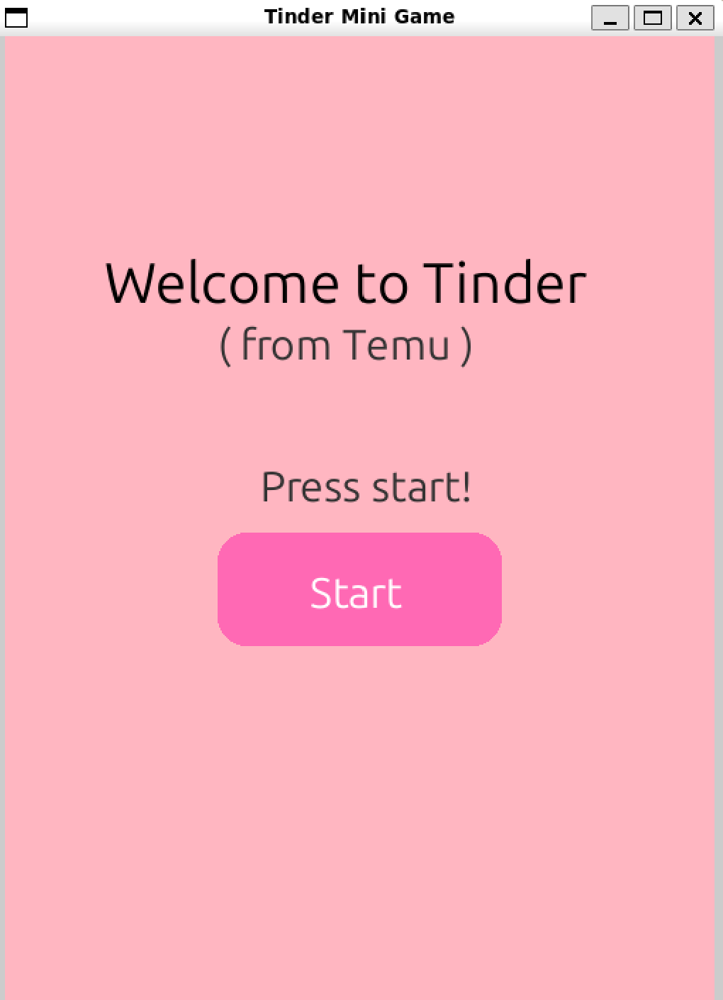

# Tinder-mini-game-

Description:

Good morning , afternoon and evening everybody!
Welcome to my mini game based on Tinder (not sponsored).
I need to clarify, that this is just a game for fun, 
that is solving only the problem of boredom.
This game made for everybody who wants to play it,
meet bunch of different characters , like or deslike them
and most importantly HAVE FUN!

Main menu:

Installation:
Step 1
Clone or download the repository
Step 2
Open the project folder in VS Code
Step 3
Install all requirements: pip install -r requirements.txt
Step 4
Run the project : python main.py

Usage:

My opinion:
I have a perfect project, but nothing is perfect,
so I will put myself 99/100

TODO:

Pass the course python2 :)

Structure:
TINDER-MINI-GAME/
├── README.md
├── game.py
├── characters.py
├── requirements.txt
├── main.py
├── images

Members:

- GitHub: [@alieva04042008-jpg](https://github.com/alieva04042008-jpg)
- Email: alieva04042008@gmail.com

Support: 
Put me 30/30 pls 